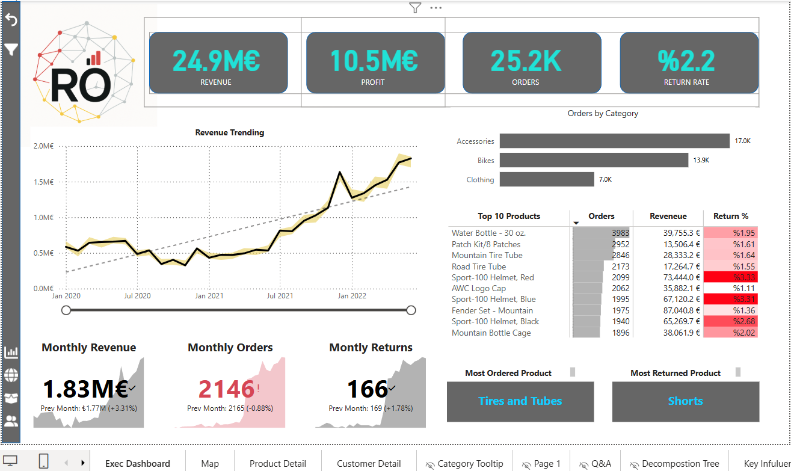
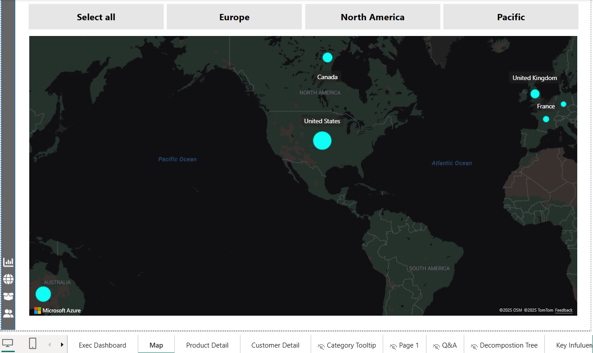
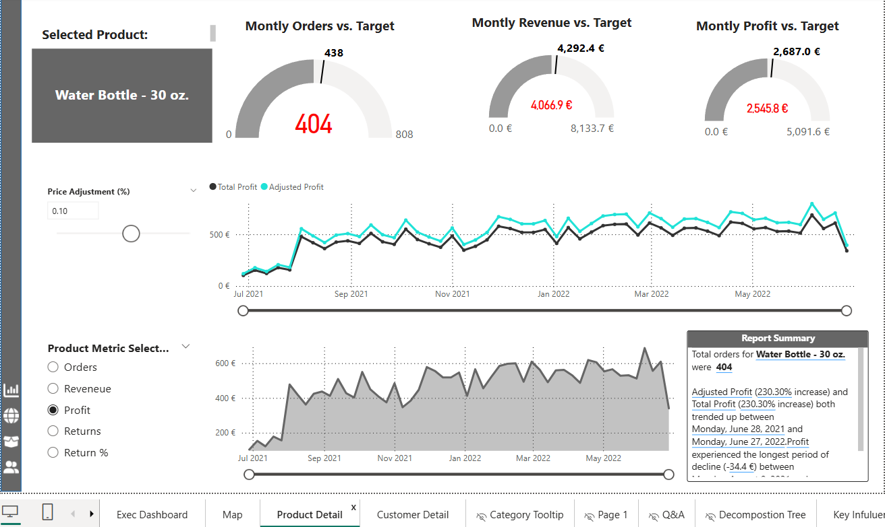
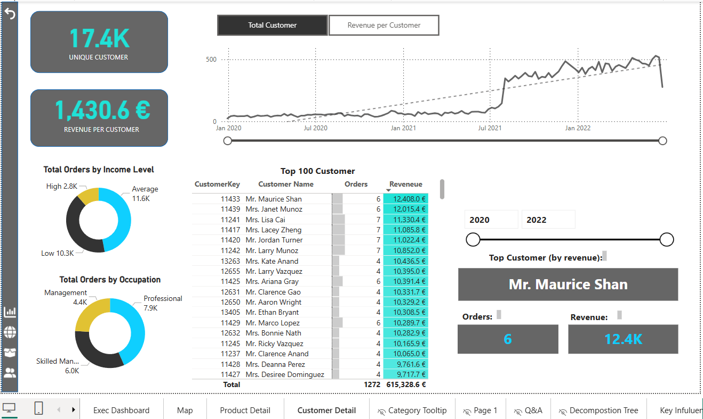
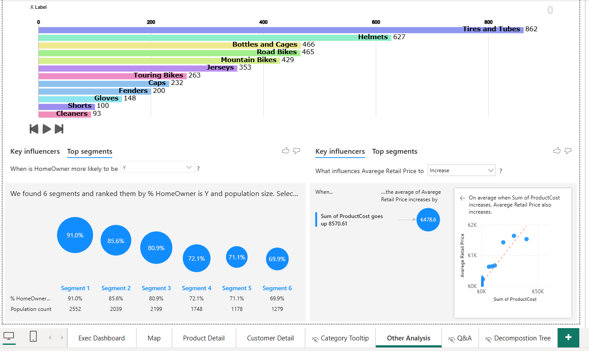

# 📊 Power BI Verkaufsanalyse Dashboard

In diesem Projekt habe ich ein interaktives Power BI-Dashboard entwickelt, das auf einem praxisnahen, simulierten Vertriebsdatensatz basiert. Ziel war es, wichtige Geschäftszahlen visuell aufzubereiten und datenbasierte Entscheidungen zu ermöglichen.

## 💡 Highlights

- Interaktives Dashboard mit KPI-Karten
- Drillthrough- und Drilldown-Funktion
- What-if-Analyse (z. B. Adjusted Profit)
- Key Influencer Visual & Forecast (AI Insights)
- Benutzerdefinierte Tooltips und Bookmarks
- Datenmodellierung im Sternschema

## 🛠 Verwendete Technologien

- Power BI (DAX, Power Query, M-Code)

## 📷 Screenshots

### 🌐 Übersicht (KPI & Trends)

### 🌍 Geografische Analyse

### 🧮 Produktanalyse mit What-if

### 👥 Kundenanalyse

### 💡 Key Influencer & AnimatedChart

## 👤 Autor

**Ramazan Örsal**  
[LinkedIn-Profil ansehen]([https://www.linkedin.com/in/ramazan-oersal-dataanalysis](https://www.linkedin.com/in/ramazan-%C3%B6rsal-dataanalyst/?locale=de_DE)
